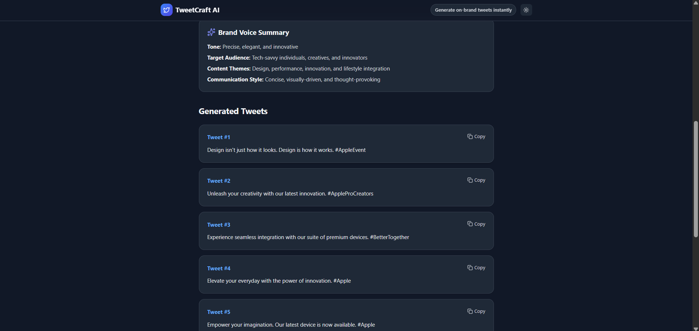
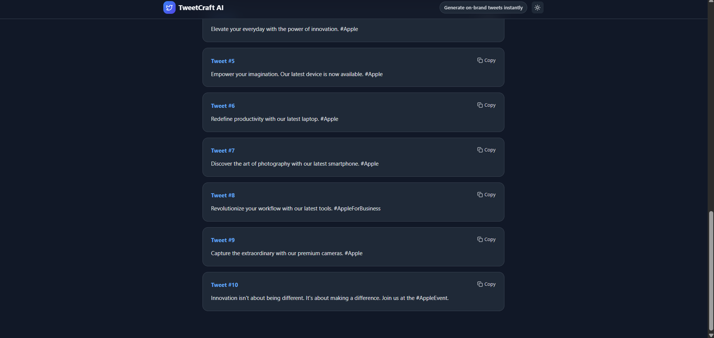
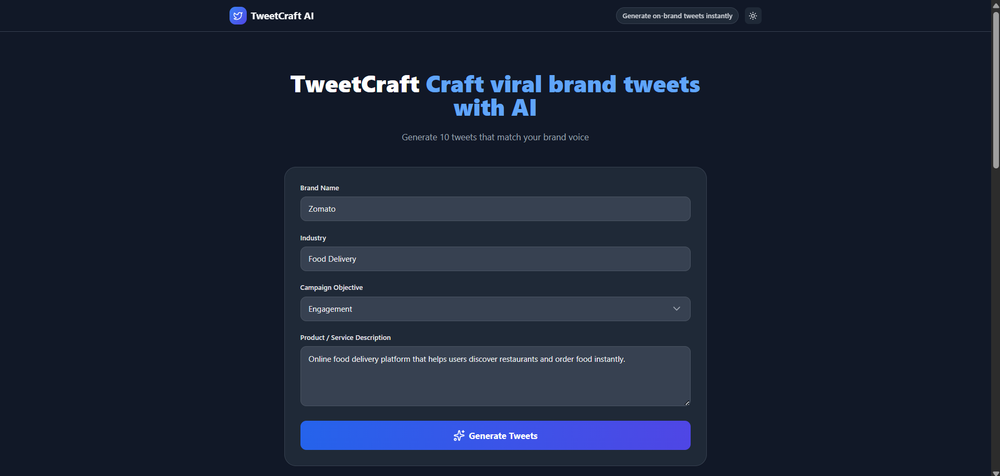
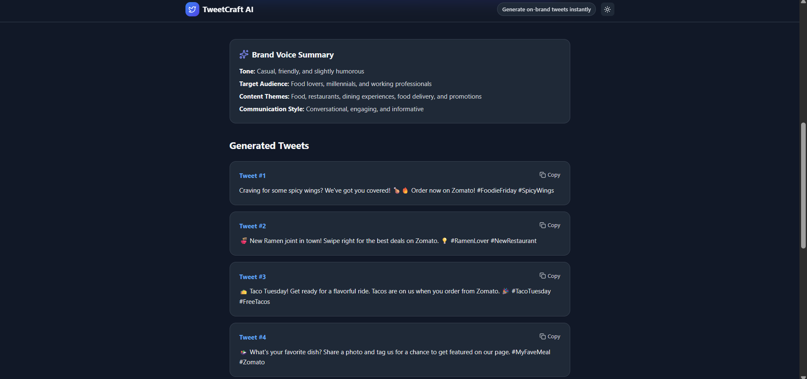
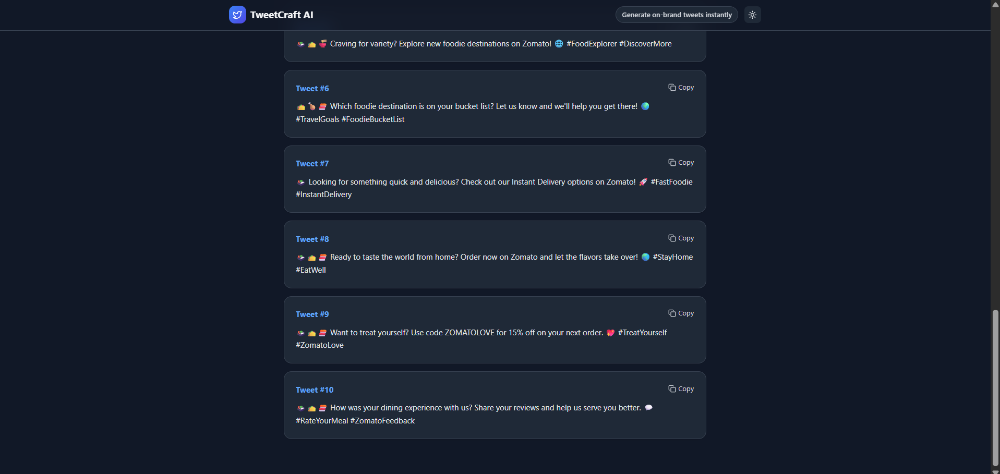
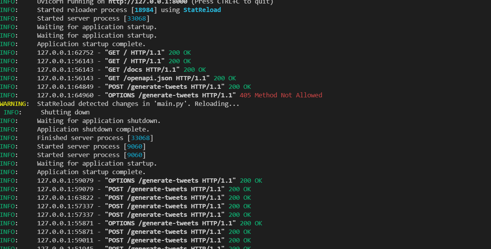
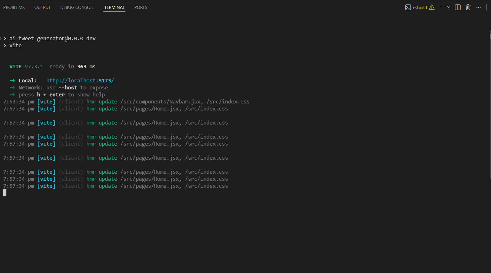
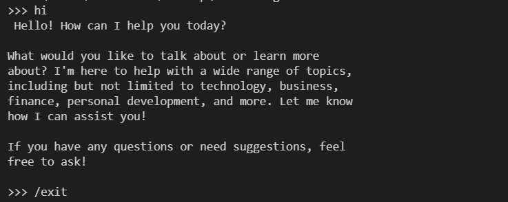

## ✍️ Author

**Gorantla Jahnavi Reddy**

📧 **Email:**  
jahnavi0405@gmail.com  

🔗 **GitHub:**  
https://github.com/Jahnavi-9741/AI_TWEET_GENERATOR

## ⌯⌲ TweetCraft AI

TweetCraft AI analyzes a brand’s **industry**, **campaign objective**, and **product description** to generate tweets that match the brand’s **tone**, **personality**, and **communication style**.

-----

## 🖥️ User Interface

### Bright Mode


### Dark Mode


---
### The system produces:

- **Brand Voice Summary**
- **10 AI-generated tweets**
- Tweets with different styles:
  - Engaging
  - Promotional
  - Conversational
  - Informative
------

## Project Objective

The goal of this project is to build a system where a user can input **brand information** and automatically generate tweets that align with the brand’s **communication style**.

### The system identifies:

- **Brand tone**
- **Target audience**
- **Content themes**
- **Communication style**

and generates **relevant social media content**.

--------

## Key Features

- **AI-generated tweets** based on brand inputs
- **Brand voice analysis**
- **Clean modern UI**
- **Dark mode support**
- **Copy tweet functionality**
- **FastAPI backend API**
- **Local LLM integration using Mistral via Ollama**
- **React + Tailwind frontend**

------
## 🗁 Project Folder Structure
```
AI_TWEET_GENERATOR
│
├── src
│ ├── components
│ │ ├── Navbar.jsx
│ │ ├── BrandForm.jsx
│ │ ├── TweetCard.jsx
│ │ ├── TweetsList.jsx
│ │ ├── VoiceSummary.jsx
│ │ └── Loader.jsx
│ │
│ ├── pages
│ │ └── Home.jsx
│ │
│ ├── context
│ │ ├── ThemeContext.js
│ │ ├── ThemeProvider.jsx
│ │ └── useTheme.js
│ │
│ ├── api
│ │ └── api.js
│ │
│ └── assets
│
├── backend
│ ├── main.py
│ ├── prompts.py
│ └── requirements.txt
│
├── index.html
├── package.json
├── tailwind.config.js
├── vite.config.js
└── README.md

```
## System Architecture

```
System Architecture

1. User Input 
   The user enters brand information such as brand name, industry, campaign objective, and product description.

2. Frontend Interface (React + Tailwind)
   The React UI collects user input and prepares the request.

3. API Request (Axios)  
   Axios sends the request from the frontend to the backend API.

4. FastAPI Backend 
   The backend receives the request and processes the input data.

5. Prompt Construction
   The system builds a structured prompt using the brand information.

6. Local LLM (Mistral via Ollama) 
   The prompt is sent to the local Mistral model running via Ollama.

7. Generated Tweets Returned to UI 
   The model generates tweets and sends them back to the frontend for display.
```
----

## </> Technologies Used

###  Frontend

| Technology | Logo |
|------------|------|
| React |  |
| Vite |  |
| TailwindCSS |  |
| Lucide Icons |  |
| Axios |  |

---

###  Backend

| Technology | Logo |
|------------|------|
| Python |  |
| FastAPI |  |

---

###  AI Model

| Technology | Logo |
|------------|------|
| Mistral LLM |  |
| Ollama |  |

---

###  Development Tools

| Technology | Logo |
|------------|------|
| Node.js |  |
| Git |  |
| GitHub |  |
| VS Code |  |

---

## Frontend Setup

####  Navigate to the project folder:

```cd ai-tweet-generator```

#### Install dependencies:

``` npm install ```

#### Run the frontend:

```npm run dev```

#### Frontend will start at:
``` http://localhost:5173```

-------

## Backend Setup

#### Navigate to backend folder:

```cd backend```

#### Create virtual environment:

```python -m venv venv```

#### Activate environment:

* Windows:

```venv\Scripts\activate```

#### Install dependencies:

```pip install -r requirements.txt```

#### Run FastAPI server:

``` uvicorn main:app --reload```

#### Backend runs at:

``` http://localhost:8000 ```

---------

## Installing Mistral Model (Ollama)

#### Install Ollama:

```https://ollama.com```

#### Verify installation:

```ollama --version```

#### Download the Mistral model:

```ollama pull mistral```

#### Run the model:

```ollama run mistral```

**The backend will connect to this model for generating tweets.**

-----

## API Endpoint
```
POST /generate-tweets

Example request body:

{
"brand_name": "Zomato",
"industry": "Food Delivery",
"objective": "Engagement",
"product_description": "Online food delivery service"
}
```

**Response includes:**
Brand voice summary
10 generated tweets

-----

## Example — Apple

### Output Screenshots






---

## Example — Zomato

### Output Screenshots








----

## 💻 Terminal Screenshots

### Backend Server


### Frontend Server


### Model Running (Ollama)

----

## How Brand Voice is Analysed

Brand voice is inferred using **prompt-based reasoning**.

### Inputs Used

- **Brand name**
- **Industry**
- **Campaign objective**
- **Product description**

### From this information, the AI determines:

- **Tone** (witty, premium, humorous, informative)
- **Target audience**
- **Content themes**
- **Communication style**

These elements guide the **tweet generation process**, ensuring that the generated tweets align with the brand’s identity and messaging style.


